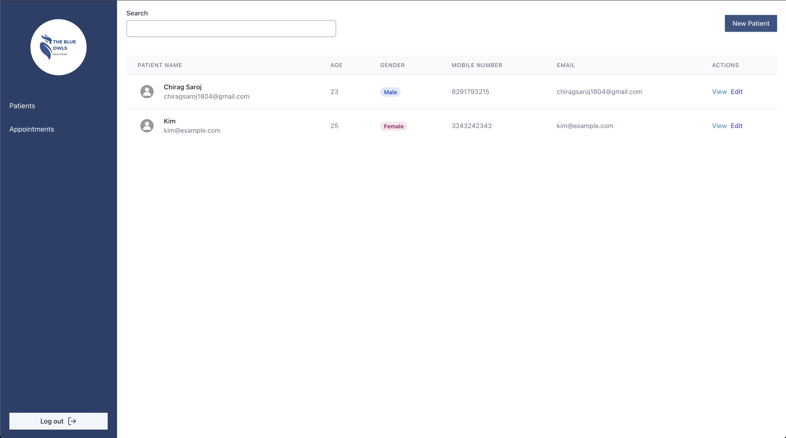
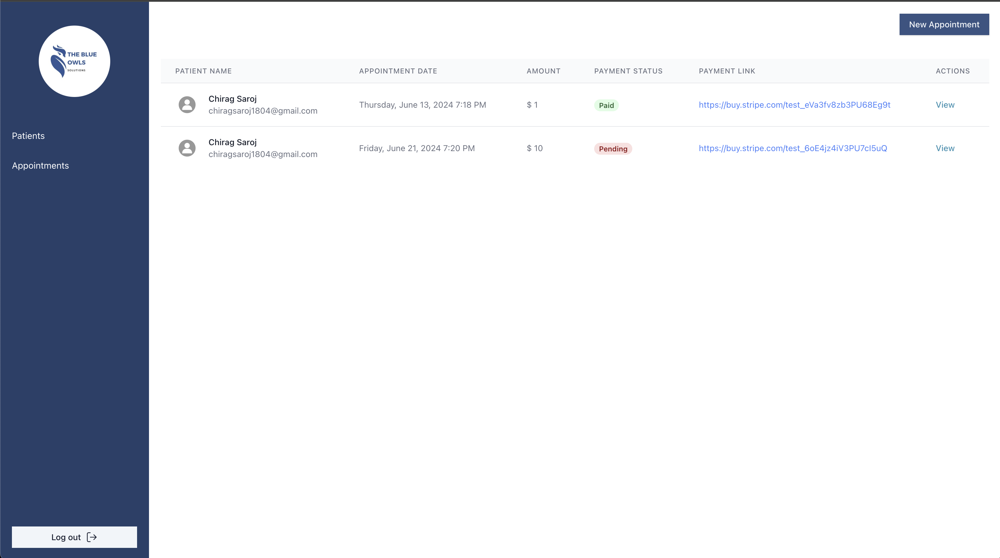

# Patient Appointment System

A system where patients can be added and appointments can be scheduled with notes.

## Click to open project demo video

[](https://www.youtube.com/watch?v=8P7WY4eXlPY)

```bash
git clone git@github.com:chiragsaroj/assignment-blueowls.git
```

Give permission to run bash script
```bash
chmod +x start_client.sh start_server.sh seed.sh
```

go to project directory
```bash
cd assignment-blueowls
```

### Steps to start client server
run this bash script to start react server
```bash
./start_client.sh
```

### Steps to start backend server
run this bash script to start fastapi server
```bash
./start_server.sh
```

### After starting both the server run this seed script to create a default user for admin panel
```bash
 ./seed.sh
```

#### Go to [http://localhost:5173/login](http://localhost:5173/login) for admin panel login

Login credentials
```
username :- admin
password :- password
```

#### Patient Detail View url [http://localhost:5173](http://localhost:5173)

# Project Screenshots




